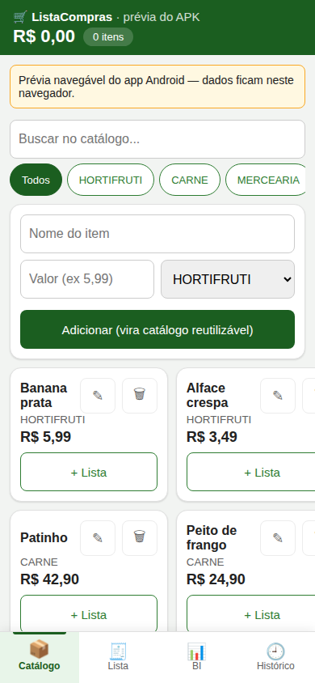
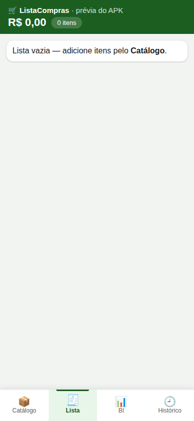
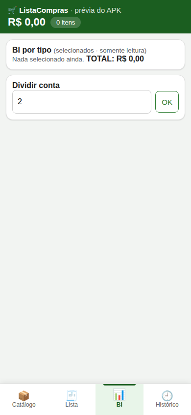
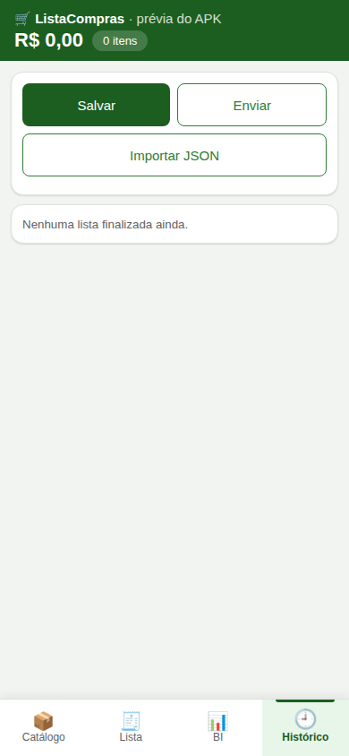

# 🛒 ListaCompras — App Android de lista de supermercado

Offline-first em **Kotlin + Jetpack Compose + Room**, com catálogo reutilizável, fechamento com envio via WhatsApp, BI de gastos e sincronização de eventos em fila offline. Planejamento completo em [`docs/`](docs/) (visão, SRS, UML, backlog).

> Telas abaixo: prévia web interativa ([`docs/index.html`](docs/index.html)) com o mesmo padrão visual do APK.

## ✨ O que o app faz

- **Catálogo reutilizável** — cadastre uma vez (nome, valor, categoria, quantidade/unidade, marca) e use com `+ Lista` em toda compra.
- **Lista ativa com total ao vivo** — marque no carrinho e acompanhe o total; stepper por unidade, edição de item e pergunta do estabelecimento no 1º item.
- **Fechar e compartilhar** — fecha na aba, zera o contador e envia via WhatsApp com itens, preços e total.
- **Importar de volta** — cola o texto recebido (ou Compartilhar → ListaCompras) e a lista entra pronta no app.
- **BI e Histórico** — gastos por tipo, global de finalizadas, dividir conta; histórico mostra só listas fechadas, com ver/excluir.
- **Modo escuro, cabeçalho próprio e fila offline** — eventos sincronizam sozinhos quando a rede volta (Ajustes → endpoint).

## 📱 Telas

### Catálogo — cadastro e `+ Lista`


Cadastro direto (nome, valor, categoria e unidade em lista, marca) e grade de itens com preço e botão `+ Lista`.

### Lista — compra com total ao vivo


Itens marcados ficam verdes, total no topo, stepper de quantidade, edição, fechar lista e importar texto.

### BI — por tipo e dividir conta


Barras por categoria sobre os selecionados, total geral e divisão da conta por pessoa.

### Histórico — só finalizadas


Cada registro tem **Ver lista** (somente leitura) e **Excluir**; export/import JSON de backup no topo.

## 🧱 Stack e arquitetura

Kotlin · Compose Material3 · Room (v6, migrations testadas) · DataStore · Hilt · Navigation · WorkManager (sync) · kotlinx.serialization. MVVM por feature (`presentation/<tela>`), DAOs reativos com Flow, `docs/03-arquitetura-e-uml.md` com os diagramas e `docs/04-ADRs/` com as decisões.

## 🔒 Privacidade

Offline-first: sem conta, sem rastreio; rede só para o sync configurado em Ajustes (ver `docs/04-ADRs/ADR-002-permissoes-rede.md`) e auditoria em `docs/security/LAUDO-2026-10-09.md`.

## 🚀 Rodar o projeto

Pré-requisitos na máquina (já instalados aqui): JDK 17 em `~/tools`, Android SDK em `~/Android/Sdk`.

```bash
source ~/Android/env.sh
cd apps/mobile/ListaCompras
./gradlew :app:assembleDebug            # APK em app/build/outputs/apk/debug/
./gradlew :app:testDebugUnitTest        # testes unitários
./gradlew :app:connectedDebugAndroidTest # instrumentados (com aparelho)
```

APKs prontos na raiz (`ListaCompras-vX.Y-*.apk`) — histórico em [`CHANGELOG.md`](CHANGELOG.md).

## 🤝 Contribuir

Toda demanda vira **issue** antes de virar código (`gh issue list`). Branches de trabalho: `DEV`; convenção de commits em `docs/06-plano-de-entrega.md`.
