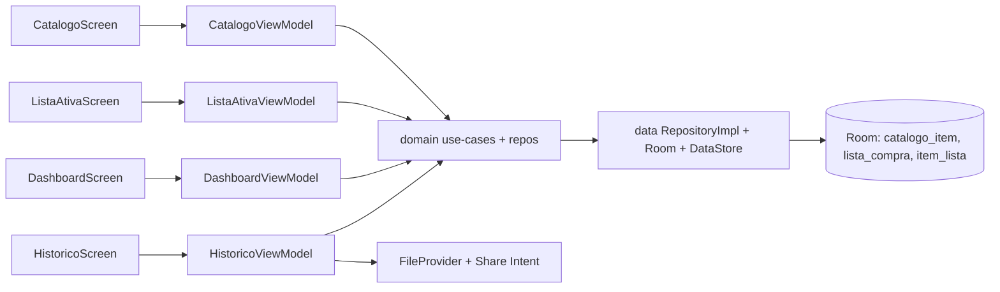
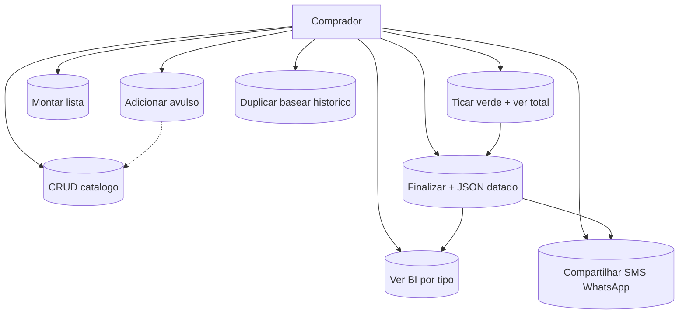
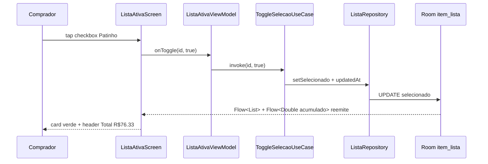
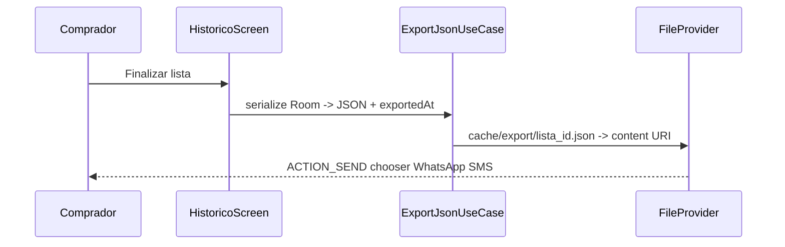

# 03 — Arquitetura e UML — ListaCompras

> Clean + MVVM, Single-Activity, Room fonte da verdade. Contribuições: datamaster (modelo) + mobilemaster (pastas).

## 1. Visão componentes
- `presentation -> domain <- data`; domain puro-Kotlin.
- Telas: Catálogo, ListaAtiva (verde+total topo), Dashboard (Canvas barras), Histórico (export/share).



## 2. Casos de uso


## 3. Classes / ER (Room)
```mermaid
erDiagram
  CATALOGO_ITEM ||--o{ ITEM_LISTA : origina
  LISTA_COMPRA ||--|{ ITEM_LISTA : contem
  CATALOGO_ITEM {
    TEXT id PK
    TEXT nome UK
    TEXT tipo
    TEXT unidadeDefault
    REAL precoRef
  }
  LISTA_COMPRA {
    TEXT id PK
    TEXT nome
    INTEGER dataCriacao_epoch
    TEXT dataCompra_ISO
    INTEGER finalizada
  }
  ITEM_LISTA {
    TEXT id PK
    TEXT listaId FK
    TEXT catalogoItemId FK_NULL
    TEXT nome_snapshot
    TEXT tipo_snapshot
    REAL quantidade
    REAL precoUnit
    INTEGER selecionado
  }
```
Entidades Kotlin + DAOs + `TotalPorTipo` + `acumuladoSelecionados()` + `totalPorTipo()` — ver detalhamento datamaster arquivado neste doc (snapshot 3FN, índices listaId/tipo/selecionado, Migration 1→2 sem destructive).

## 4. Sequência — fluxo principal (ticar no mercado)


## 5. Sequência — finalizar/export/share


## 6. Exemplo JSON (schema v2)
```json
{
  "app": "ListaCompras", "schemaVersion": 2,
  "exportedAt": "2026-10-07T14:30:00-03:00",
  "listas": [{
    "id": "lst_01J9", "nome": "Compra semanal 05/10",
    "dataCriacao": 1728145200000, "dataCompra": "2026-10-05T11:20:00-03:00",
    "finalizada": true,
    "itens": [
      {"id":"it_001","nome":"Banana prata","tipo":"HORTIFRUTI","unidade":"kg","quantidade":2.0,"precoUnit":5.99,"selecionado":true,"ordem":0},
      {"id":"it_002","nome":"Patinho","tipo":"CARNE","unidade":"kg","quantidade":1.5,"precoUnit":42.90,"selecionado":true,"ordem":1}
    ]
  }]
}
```

## 7. Estrutura pastas (Gradle Kotlin DSL)
`apps/mobile/ListaCompras/app/src/main/java/br/com/listacompras/{data/local/{AppDatabase,dao,entity,prefs}, data/repository, domain/{model,repository,usecase}, presentation/{navigation,theme,catalogo,listaativa,dashboard,historico}, share/{ExportFileProvider,ShareHelper}}` + `res/xml/filepaths.xml` + `gradle/libs.versions.toml`. Manifest sem INTERNET.

## 8. Validação consistência
Todo RF tem UC e entidade dona; toda query BI tem teste (Q1-Q5 datamaster); nenhum dado sem dono (catálogo→CatalogoDao, lista→ListaDao).
